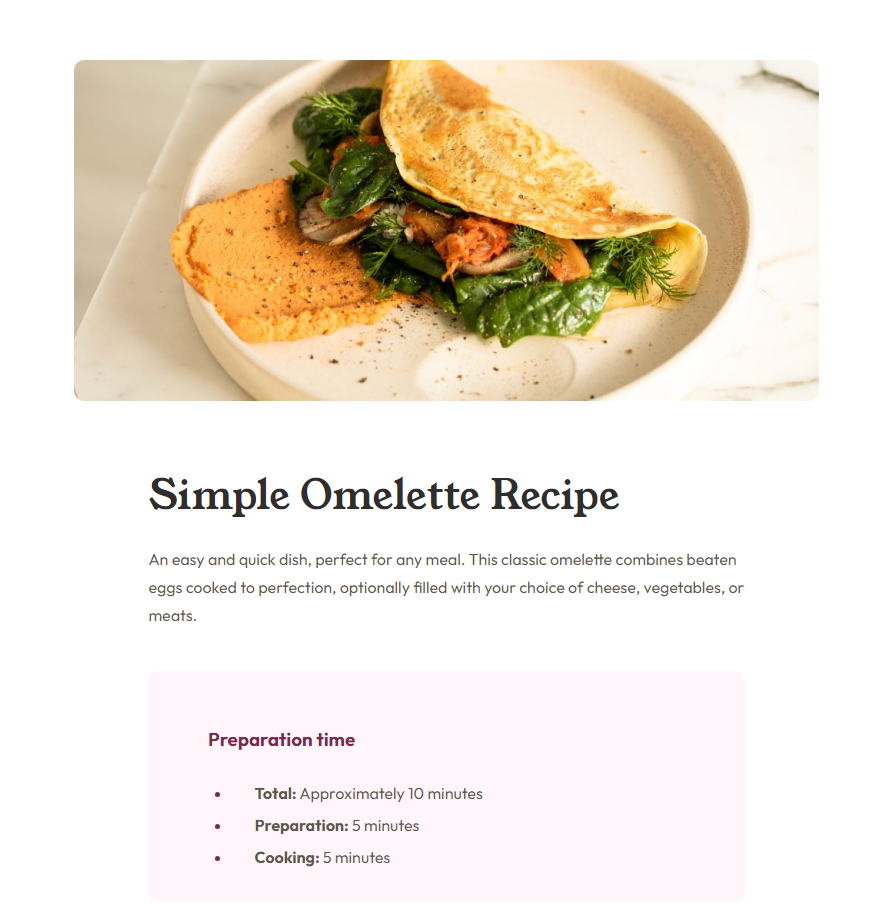
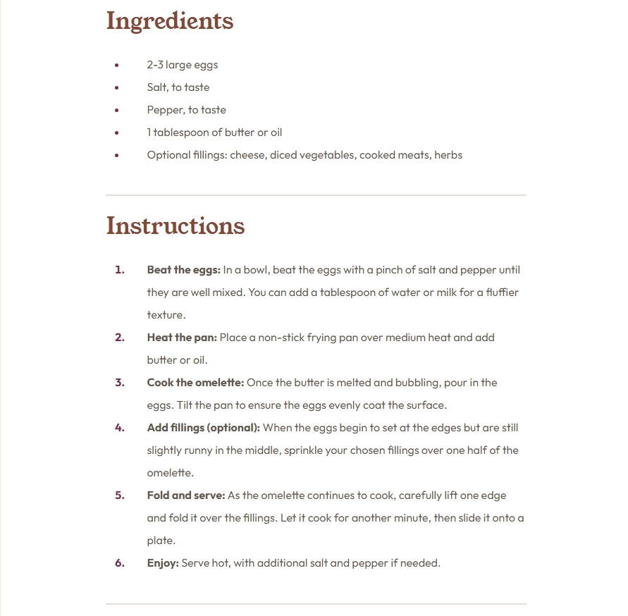
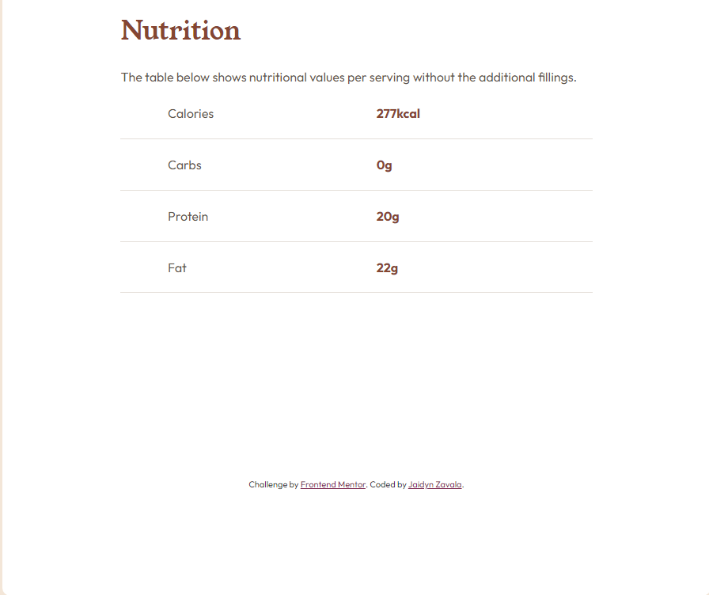

# Frontend Mentor - Recipe page solution

This is a solution to the [Recipe page challenge on Frontend Mentor](https://www.frontendmentor.io/challenges/recipe-page-KiTsR8QQKm). Frontend Mentor challenges help you improve your coding skills by building realistic projects. 

## Table of contents

- [Overview](#overview)
  - [Screenshot](#screenshot)
  - [Links](#links)
- [My process](#my-process)
  - [Built with](#built-with)
  - [What I learned](#what-i-learned)
  - [Continued development](#continued-development)
  - [Useful resources](#useful-resources)
- [Author](#author)

## Overview

### Screenshot

### Links

- Live Site URL: [Live Site](https://jaidynz.github.io/fm-recipe-page-main/)

## My process

### Built with

- Semantic HTML5 markup
- CSS custom properties
- Mobile-first workflow

### What I learned

The main thing I learned during this challenge is how to work with variables, which I am now wishing I learned much sooner. Variables are incredibly powerful and save so much time, it's definitely something I can see myself using often in the future.

This challenge is also the first time I used the live site plugin in VSC and I absolutely love it, I cannot imagine coding without it now.

### Continued development

I really want to experiment more with variables, I want to see the limits of them if they even have any.

### Useful resources

- [Styling an horizontal rule](https://www.w3schools.com/howto/howto_css_style_hr.asp) - This site helped me learn how to style a horizontal rule.

## Author

- Frontend Mentor - [@JaidynZ](https://www.frontendmentor.io/profile/JaidynZ)
